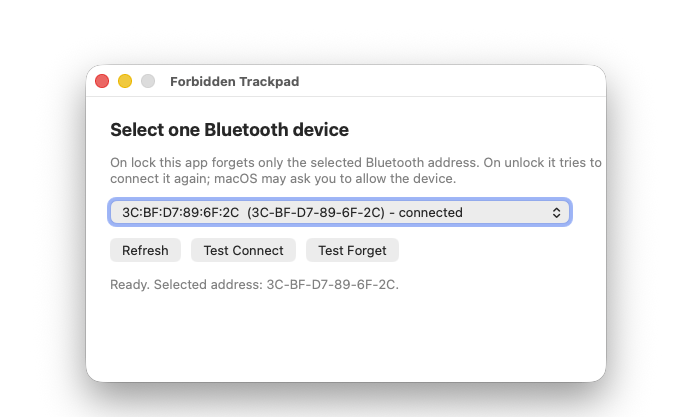

# Forbidden Trackpad

Forbidden Trackpad is a tiny macOS menu bar app for using one Magic Trackpad with two nearby MacBooks, without a KVM switch.

It is built for a one-active-Mac-at-a-time workflow: lock the Mac you are leaving, use the other one, then unlock back later.

It remembers one selected Bluetooth device. When this Mac locks or sleeps, the app forgets only that selected device so another Mac can take it. When this Mac unlocks, wakes, or the app starts, it tries to reconnect the same device back.

No network, no accounts, no analytics. The app is intentionally narrow: one selected Bluetooth address, one job.

**Important:** after unlocking a Mac, wake the trackpad by toggling its physical power switch off and on. This is the small switch on the back edge of the Magic Trackpad. It brings the trackpad back on air after it has been forgotten by both Macs.

## Download

Download the latest DMG from [GitHub Releases](https://github.com/Syntaxys-dll/forbidden-trackpad/releases/latest):

[Download ForbiddenTrackpad.dmg](https://github.com/Syntaxys-dll/forbidden-trackpad/releases/latest/download/ForbiddenTrackpad.dmg)



## Why This Exists

This app is for a very specific desk setup:

- two MacBooks are used at the same desk, for example one work MacBook and one personal MacBook;
- both can be closed and connected to external monitors;
- one Apple Magic Trackpad is shared between them;
- the Mac you want to use can be activated with another input device, for example a Bluetooth keyboard;
- you do not want to use a KVM switch just to move one trackpad;
- macOS does not provide a fast, reliable way to move the same Bluetooth trackpad between the two Macs.

Universal Control is useful when your Macs can participate in the same Apple ecosystem workflow. It may not fit work/personal setups, different Apple IDs, managed work laptops, company policies, closed-lid monitor setups, or cases where you simply want only one Mac to be active at a time.

In this setup, the problem is not moving the pointer across two active Macs. The problem is moving the actual Bluetooth ownership of one Magic Trackpad when you stop using one Mac and start using the other.

Forbidden Trackpad exists to make that handoff boring: lock one Mac, let the other Mac take the trackpad, then unlock the first Mac later and let it reconnect the same selected trackpad.

## Why It Works

Magic Trackpad can only be actively connected to one Mac at a time. If one Mac keeps the trackpad paired and available, the other Mac may not be able to grab it reliably.

Forbidden Trackpad handles this by doing two things:

1. On lock or sleep, it forgets the selected trackpad on this Mac. This releases the stale Bluetooth pairing state that can keep the trackpad stuck to the wrong machine.
2. On unlock, wake, or app start, it tries to reconnect that same saved Bluetooth address. If the first attempt misses because the trackpad is asleep or still settling, it retries for a while.

This is intentionally not a general Bluetooth switcher. The app remembers one selected Bluetooth address and only acts on that address.

## Safety

- Forbidden Trackpad only acts on the Bluetooth address you select.
- The selected address is stored per Mac, so each Mac can remember its own target device.
- The app does not intentionally modify other Bluetooth devices.
- The app does not send data anywhere.
- On first launch, the app installs a per-user LaunchAgent at `~/Library/LaunchAgents/app.forbiddentrackpad.ForbiddenTrackpad.plist` so it can start at login.
- The app uses `IOBluetooth` and a few private Bluetooth device selectors to force the selected device to be forgotten on lock. This is practical, but not officially supported by Apple and may break on future macOS versions.

## Requirements

- macOS 13 or newer.
- Apple Silicon Mac.
- Apple Magic Trackpad tested as the intended device.

The current build is arm64 only. Intel Macs are not supported by the current build script.

## Tested Setup

The handoff flow was tested with:

- MacBook Pro with M1 Pro;
- MacBook Air with Apple M2;
- Apple Magic Trackpad;
- one confirmed target machine running macOS 15.7.5 (24G624) on Apple M2.

The current build was also compiled and checked on macOS 26.6.2 (25G83), arm64.

Other Apple Silicon Macs on macOS 13 or newer may work, but have not been broadly tested yet.

## Install

Download or build `ForbiddenTrackpad.app`, then move it to `/Applications`.

The app is currently ad-hoc signed and not notarized with Apple Developer ID, so macOS may block the first launch.

Try this first:

1. Right-click `/Applications/ForbiddenTrackpad.app`.
2. Choose `Open`.
3. In the warning dialog, click `Open` again if macOS shows the button.

If macOS still says it cannot open the app:

1. Open `System Settings`.
2. Go to `Privacy & Security`.
3. Scroll to the Security section.
4. Click `Open Anyway` for `Forbidden Trackpad`.
5. Launch `ForbiddenTrackpad.app` again.

If macOS still blocks it because of quarantine, run:

```sh
xattr -cr "/Applications/ForbiddenTrackpad.app"
open "/Applications/ForbiddenTrackpad.app"
```

## Setup

Do this on each Mac that should use the trackpad:

1. Open `ForbiddenTrackpad.app`.
2. Select your Magic Trackpad from the device list.
3. Click `Test Forget`.
4. Click `Test Connect`.
5. If macOS shows a connection request, click `Allow`.

After setup, the app starts automatically at login.

## Daily Use

Typical handoff:

1. Lock Mac 1.
2. Use the trackpad with Mac 2.
3. Lock Mac 2.
4. Unlock Mac 1.
5. Forbidden Trackpad reconnects the selected trackpad back to Mac 1.

macOS may show a device connection prompt after a forget/reconnect. If the trackpad already works, click `Allow` anyway to finish pairing cleanly.

## Current Behavior

- On app start: tries to reconnect the selected trackpad.
- On first launch: installs a per-user LaunchAgent for login startup.
- On screen lock, session inactive, screen sleep, or system sleep: stops auto reconnect and forgets the selected trackpad.
- On unlock, wake, or screen wake: starts auto reconnect.
- Auto reconnect tries immediately, then retries about every 10 seconds.
- Auto reconnect stops as soon as the selected trackpad connects.
- Auto reconnect stops after 10 minutes if the trackpad does not connect.
- Auto reconnect does not run while the Mac is locked or sleeping.
- A new Bluetooth action is not started while another Bluetooth action is still running.

## Trackpad Wake Notes

If both Macs have forgotten the trackpad and it has been idle for a while, the trackpad may go into a low-power state and disappear from nearby Bluetooth devices.

Try, in order:

1. Tap or click the trackpad.
2. Wait 5-10 seconds.
3. Press `Test Connect` or let auto reconnect retry.
4. If it still does not appear, toggle the physical power switch on the trackpad off and on.

## Build

```sh
./build.sh
```

The app bundle is created at:

```text
build/ForbiddenTrackpad.app
```

To create a DMG manually:

```sh
./Scripts/create_dmg.sh
```
